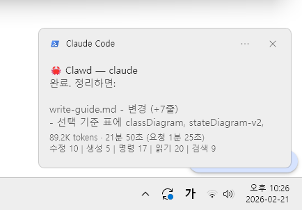
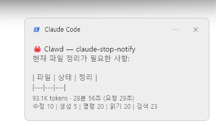
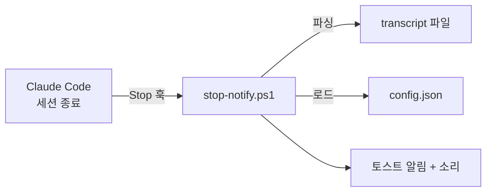
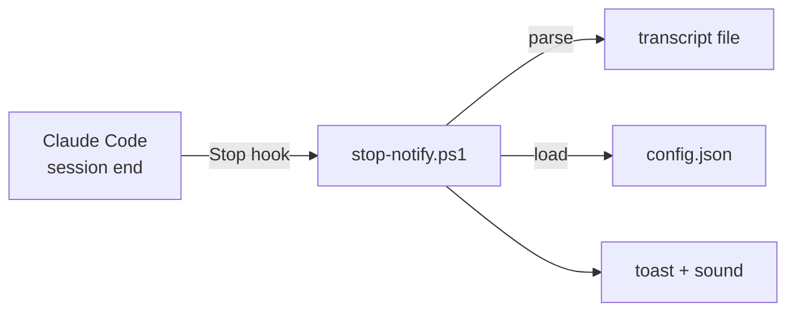

# claude-stop-notify


[](LICENSE)

Claude Code 세션이 끝나면 Windows 토스트 알림으로 대화 요약을 보여주는 플러그인이다. 긴 작업을 시켜놓고 다른 일을 하다가, 알림 하나로 완료 시점을 바로 알 수 있다.

---

A Claude Code plugin that shows a Windows toast notification with a conversation summary when a session ends. Fire off a long task, switch to something else, and get notified the moment it's done.

> **[English](#english)** — See below for English documentation.

---


<p align="center">
  
  
</p>


## 특징

- **자동 알림** — 세션이 끝나면 별도 조작 없이 토스트 알림이 뜬다
- **응답 요약** — Claude의 마지막 응답을 마크다운 정리 후 본문에 표시
- **세션 통계** — 토큰 사용량, 소요 시간, 도구 호출 횟수를 한눈에
- **커스터마이징** — `config.json` 하나로 소리, 제목, 표시 시간 등을 변경
- **설치 한 줄** — 플러그인 설치 후 추가 설정 없이 바로 동작


## 설치

```bash
claude plugin add --url https://github.com/nbh-4/claude-stop-notify
```

설치하면 끝이다. 별도 설정 없이 Claude Code 세션이 종료될 때마다 자동으로 알림이 뜬다.

로컬에서 직접 테스트하려면 `--plugin-dir` 옵션을 사용한다.

```bash
claude --plugin-dir ./claude-stop-notify
```


## 동작 원리



Claude Code의 Stop 훅이 발동하면 스크립트에 `hookData`(작업 디렉토리, transcript 경로)가 stdin으로 전달된다. 스크립트는 transcript JSONL 파일을 파싱하여 토큰, 시간, 도구 횟수, 마지막 응답 텍스트를 추출하고 WinRT 토스트 알림을 띄운다.


## 알림 구조

토스트 알림은 세 영역으로 나뉜다.

```
┌─────────────────────────────────────────┐
│ 🦀 Clawd — 프로젝트명          (title)   │
│                                         │
│ Claude의 마지막 응답 텍스트        (body)  │
│ (마크다운 제거, 최대 2000자)               │
│                                         │
│ 150.3K tokens · 5분 32초        (footer) │
│ 수정 3 | 생성 1 | 명령 5 | 읽기 12        │
└─────────────────────────────────────────┘
```


### title

`{title} — {프로젝트명}` 형식이다. 프로젝트명은 `hookData.cwd`의 마지막 폴더명에서 가져온다. title은 `config.json`의 `title` 키로 변경할 수 있다.


### body

Claude의 마지막 assistant 응답에서 텍스트 블록만 추출한 뒤, 마크다운 문법(`**`, `` ` ``, `#`, `[]()`)을 정규식으로 제거한 결과다. `maxSummaryLength`(기본 2000자)를 초과하면 잘라내고 `...`을 붙인다.

transcript를 뒤에서부터 역순 탐색하여 가장 마지막 `"type": "assistant"` 메시지를 찾고, 그 안의 `content` 배열에서 `type`이 `"text"`인 블록만 합친다. 텍스트 블록이 없는 assistant 응답(도구 호출만 있는 경우)은 건너뛴다.


### footer

토스트 하단 attribution 영역이다. 최대 2줄로 구성되며, 데이터가 없는 줄은 생략된다. 두 줄 모두 비어 있으면 attribution 영역 자체가 표시되지 않는다.


#### 1줄 — 토큰과 시간

`150.3K tokens · 5분 32초 (요청 1분 20초)` 형태로 표시된다.

**토큰 산출 기준**

transcript를 뒤에서부터 역순으로 탐색하여 마지막 assistant 메시지 한 건의 `usage` 필드를 읽는다. 세션 전체 누적이 아니라, 마지막 API 호출의 사용량이다.

```
총 토큰 = input_tokens + output_tokens + cache_read_input_tokens
```

- 100만 이상 → `N.NM tokens` (소수점 1자리 반올림)
- 1000 이상 → `N.NK tokens`
- 1000 미만 → `N tokens`
- 0이면 표시하지 않음

**시간 산출 기준**

transcript의 모든 메시지에서 `timestamp` 필드를 순회하여 세 개의 시점을 기록한다.

- `firstTs` — 첫 번째 메시지의 타임스탬프
- `lastTs` — 마지막 메시지의 타임스탬프
- `lastHumanTs` — 마지막 사용자 메시지의 타임스탬프. 단, `tool_result` 타입은 제외한다. 사용자가 직접 입력한 프롬프트만 해당.

이 시점들로 두 가지 시간을 계산한다.

- **전체 시간** : `lastTs - firstTs`. 세션의 첫 메시지부터 마지막 메시지까지의 간격.
- **요청 시간** : `lastTs - lastHumanTs`. 사용자의 마지막 프롬프트부터 Claude의 마지막 응답까지의 간격.

표시 형식은 다음 규칙을 따른다.

- 1시간 이상 → `N시간 N분`
- 1분 이상 → `N분 N초` (0초면 `N분`)
- 1분 미만 → `N초`

최종적으로 `전체시간 (요청 요청시간)` 형태로 조합된다. 요청 시간을 산출할 수 없으면 전체 시간만 표시한다.


#### 2줄 — 도구 사용 통계

`수정 3 | 생성 1 | 명령 5 | 읽기 12 | 검색 7` 형태로 표시된다.

transcript 전체 텍스트를 하나로 합친 뒤, `"name": "도구명"` 패턴을 정규식으로 매칭하여 세션 전체 누적 횟수를 집계한다. 횟수가 0인 항목은 표시하지 않는다.

| 항목 | 매칭 대상 |
|---|---|
| 수정 | `Edit` |
| 생성 | `Write` |
| 명령 | `Bash` |
| 읽기 | `Read` |
| 검색 | `Grep` + `Glob` + `WebSearch` 합산 |


## 커스터마이징

`hooks/config.json`을 편집하면 스크립트를 직접 수정하지 않고도 동작을 변경할 수 있다. 파일이 없거나 특정 키가 누락되면 해당 항목은 기본값으로 동작한다.

```json
{
  "sound": "C:\\Windows\\Media\\Windows Notify Calendar.wav",
  "appName": "Claude Code",
  "toastDuration": "long",
  "maxSummaryLength": 2000,
  "title": "🦀 Clawd",
  "lang": "ko"
}
```

| 키 | 설명 | 기본값 |
|---|---|---|
| `sound` | 알림 소리 WAV 파일 경로. 빈 문자열(`""`)이면 소리 비활성화 | `C:\Windows\Media\Windows Notify Calendar.wav` |
| `appName` | 토스트 알림의 발신 앱 이름 | `Claude Code` |
| `toastDuration` | 토스트 표시 시간. `"long"`은 약 25초, `"short"`는 약 7초 | `long` |
| `maxSummaryLength` | 요약 텍스트 최대 글자 수 | `2000` |
| `title` | 알림 제목. 프로젝트명 앞에 표시됨 | `🦀 Clawd` |
| `lang` | 알림 언어. `"ko"` (한국어) 또는 `"en"` (영어) | `ko` |


### 알림 소리

Windows에 기본 내장된 WAV 파일 중 원하는 것을 골라 쓰면 된다.

```
C:\Windows\Media\Windows Notify Calendar.wav
C:\Windows\Media\Windows Notify Email.wav
C:\Windows\Media\Windows Notify Messaging.wav
C:\Windows\Media\Windows Notify System Generic.wav
C:\Windows\Media\chimes.wav
```

`"sound": ""`로 설정하면 토스트만 표시되고 소리는 나지 않는다.

소리 재생은 별도 PowerShell 프로세스에서 처리된다. Claude Code 훅 컨텍스트에서는 오디오 장치에 직접 접근할 수 없기 때문에, `Start-Process`로 새 프로세스를 띄워 `SoundPlayer.PlaySync()`를 실행하는 구조다.


### timeout 설정

`hooks/hooks.json`에서 훅 실행 제한 시간을 조절할 수 있다.

```json
{
  "timeout": 13
}
```

단위는 초다. transcript 파일이 커지면 파싱에 시간이 걸릴 수 있으므로 10초 이상을 권장한다.


## Troubleshooting

### 알림이 뜨지 않는다

- Windows 설정 → 시스템 → 알림에서 알림이 켜져 있는지 확인한다.
- 방해 금지 모드(Focus Assist)가 활성화되어 있으면 토스트가 억제될 수 있다.
- PowerShell 5.1 이상이 설치되어 있는지 `$PSVersionTable.PSVersion`으로 확인한다.

### 소리가 나지 않는다

- `config.json`의 `sound` 경로가 실제로 존재하는 WAV 파일인지 확인한다.
- 시스템 볼륨과 앱 볼륨이 음소거 상태인지 확인한다.

### transcript 파싱 시간 초과

- 대화가 길어지면 transcript 파일이 커져서 기본 timeout(13초) 안에 파싱이 끝나지 않을 수 있다.
- `hooks/hooks.json`의 `timeout` 값을 늘려서 해결한다.


## 요구사항

- **OS** : Windows 10 / Windows 11
- **PowerShell** : 5.1 이상
- **Claude Code** : 플러그인 시스템 지원 버전


## Contributing

버그 리포트와 기능 제안은 [Issues](https://github.com/nbh-4/claude-stop-notify/issues)에 남겨주면 된다. PR도 환영한다.


## 라이선스

[MIT](LICENSE)

---

<a id="english"></a>

## English

A Claude Code plugin that shows a Windows toast notification with a conversation summary when a session ends. Fire off a long task, switch to something else, and get notified the moment it's done.


### Features

- **Auto notification** — Toast fires automatically when a session ends
- **Response summary** — Displays Claude's last response with markdown stripped
- **Session stats** — Token usage, elapsed time, and tool call counts at a glance
- **Customizable** — Change sound, title, display duration, etc. via `config.json`
- **One-line install** — Works immediately after plugin installation


### Installation

```bash
claude plugin add --url https://github.com/nbh-4/claude-stop-notify
```

That's it. A toast notification will appear automatically every time a Claude Code session ends. No additional configuration needed.

For local testing:

```bash
claude --plugin-dir ./claude-stop-notify
```


### How it works



When Claude Code's Stop hook fires, `hookData` (working directory, transcript path) is passed via stdin. The script parses the transcript JSONL file to extract token usage, timing, tool call counts, and the last response text, then displays a WinRT toast notification.


### Toast structure

```
┌─────────────────────────────────────────┐
│ 🦀 Clawd — project-name        (title) │
│                                         │
│ Claude's last response text      (body) │
│ (markdown stripped, max 2000 chars)     │
│                                         │
│ 150.3K tokens · 5m 32s        (footer)  │
│ Edit 3 | Write 1 | Bash 5 | Read 12    │
└─────────────────────────────────────────┘
```

- **title** — `{title} — {project name}`. Project name is the last folder of `hookData.cwd`.
- **body** — Text blocks from the last assistant response, with markdown syntax removed. Truncated to `maxSummaryLength` (default 2000).
- **footer line 1** — Token count (last API call's `input_tokens + output_tokens + cache_read_input_tokens`) and elapsed time (total session / last request).
- **footer line 2** — Tool usage counts across the entire session: `Edit`, `Write`, `Bash`, `Read`, `Grep`+`Glob`+`WebSearch`. Zero-count items are hidden.


### Configuration

Edit `hooks/config.json` to customize behavior. Missing keys fall back to defaults.

```json
{
  "sound": "C:\\Windows\\Media\\Windows Notify Calendar.wav",
  "appName": "Claude Code",
  "toastDuration": "long",
  "maxSummaryLength": 2000,
  "title": "🦀 Clawd",
  "lang": "en"
}
```

| Key | Description | Default |
|---|---|---|
| `sound` | WAV file path. Empty string `""` disables sound | `C:\Windows\Media\Windows Notify Calendar.wav` |
| `appName` | Toast notifier app name | `Claude Code` |
| `toastDuration` | `"long"` (~25s) or `"short"` (~7s) | `long` |
| `maxSummaryLength` | Max summary text length | `2000` |
| `title` | Notification title prefix | `🦀 Clawd` |
| `lang` | Notification language. `"ko"` (Korean) or `"en"` (English) | `ko` |


### Requirements

- **OS** : Windows 10 / Windows 11
- **PowerShell** : 5.1+
- **Claude Code** : Plugin system supported version


### License

[MIT](LICENSE)
